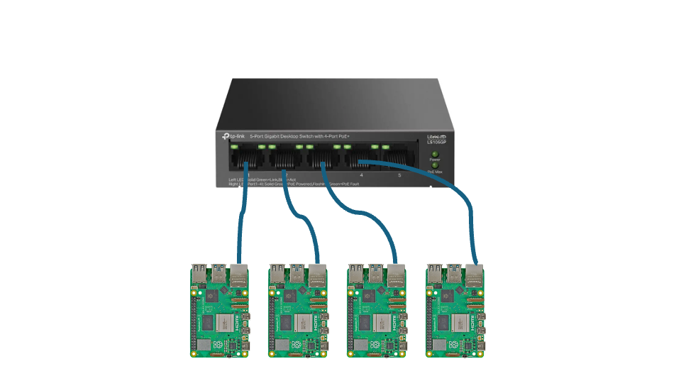
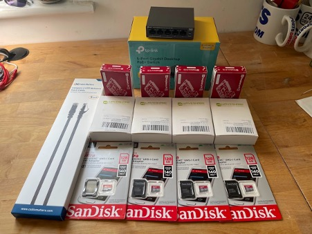
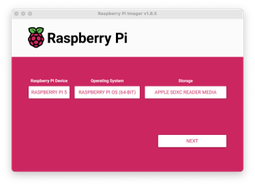
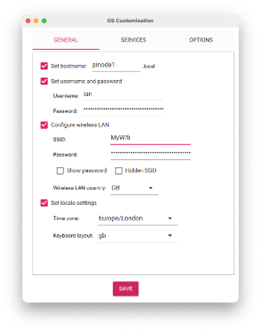
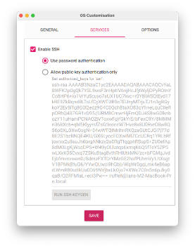
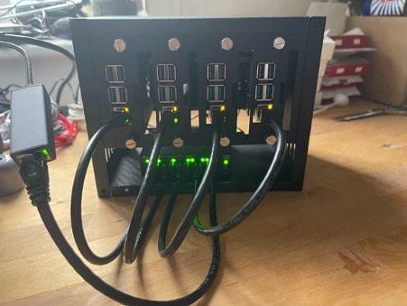
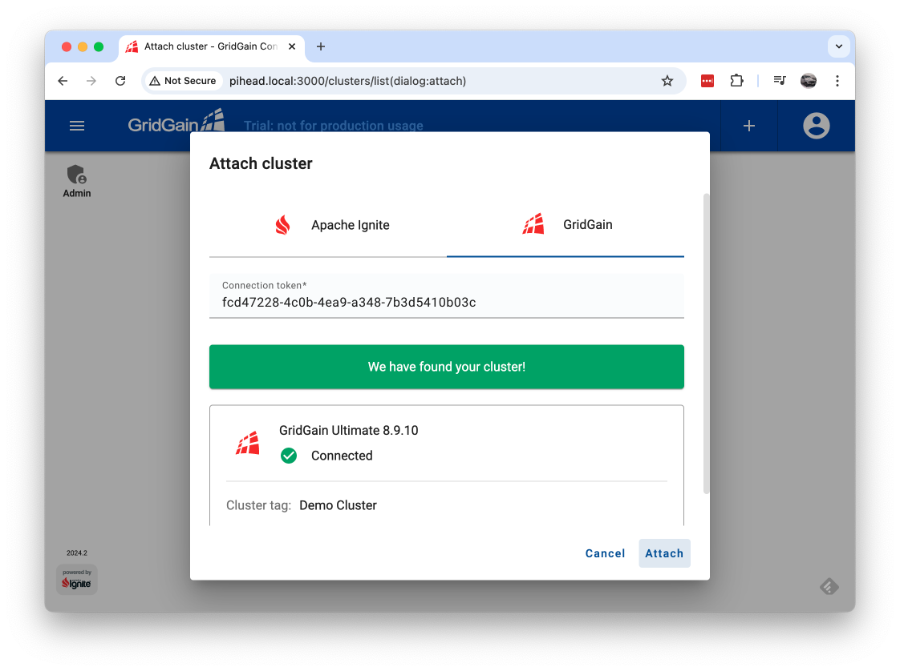
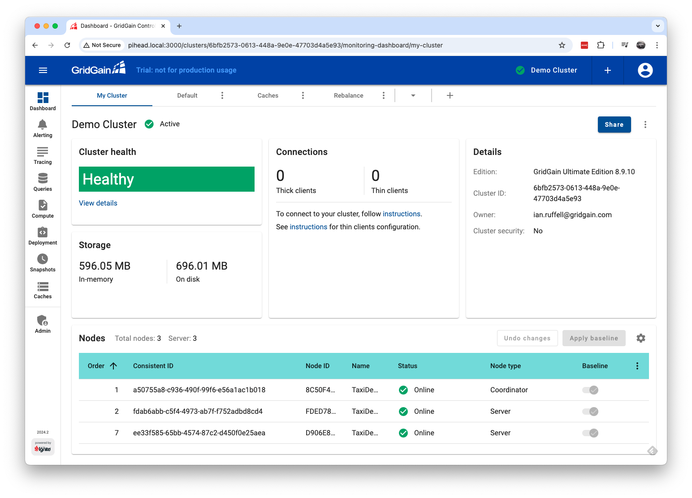

# How to build a Raspberry Pi cluster and Run a GridGain cluster on it

## What we’re going to build

We’re going to put together a four-node cluster connected to a single managed switch. One of the nodes will be the so-called "head" node. Each node will boot from an SD card as normal.  All four of our Raspberry Pi boards will have a Raspberry Pi PoE+ HAT attached. This means that, since we’re using a PoE+ enabled switch, we only need to run a single Ethernet cable to each of our nodes and don’t need a separate USB hub to power them.

##What you’ll need
* 4 x Raspberry Pi 5 8GB models
* 4 x Raspberry Waveshare Pi PoE HAT with fan
* 5-port Gigabit PoE-enabled switch
* 5 x Ethernet cables
* 4 x 128GB SD card
* Cluster case

The list of parts you’ll need to put together a Raspberry Pi cluster — sometimes known as a "bramble" — can be short, or it can be quite long, depending on what size and type of cluster you intend to build. The list above is what we used for our four-Pi cluster, but your requirements might well be different.



##Build the Pis
1.	Setup the SD cards
	1. Use the [Raspberry Pi Imager](https://www.raspberrypi.com/software/) to burn the SD cards 
		
		
	1. Chose “Edit Settings” and enter a username & Wifi details
	
		
	1. On the Services tab “Enable SSH” 
	
		
	1.	Apply the settings which will write the SD card, repeat for each node ensuring each one has a different hostname.
1.	Insert the SD cards into the Raspberry Pis, insert the POE HAT and connect them to the switch via ethernet cables and insert into the cluster case. As you can see, the fifth ethernet is connected to a laptop for access to the cluster.
	
	
1.	Configure the DHCP server
	1. ssh into your head node.
	
		```
		ssh ian@pihead.local
		```
	1. Install DHCP Server
	
		```
		sudo apt install isc-dhcp-server
		```
	1. and then edit the /etc/dhcp/dhcpd.conf file as follows:

		```
		# The internal cluster network
	group {
	   option broadcast-address 10.10.10.255;
	   #option routers 10.10.10.1;
	   default-lease-time 600;
	   max-lease-time 7200;
	   option domain-name "local";
	   option domain-name-servers 8.8.8.8, 8.8.4.4;
	   subnet 10.10.10.0 netmask 255.255.255.0 {
	      range 10.10.10.10 10.10.10.250;
	      # Head Node
	      host pihead {
	         hardware ethernet 2c:cf:67:74:7f:b6;
	         fixed-address 10.10.10.1;
	      }
	      host pinode1 {
	         hardware ethernet 2c:cf:67:74:7f:75;
	         fixed-address 10.10.10.11;
	         option host-name "pinode1";
	      }
	      host pinode2 {
	         hardware ethernet 2c:cf:67:74:7f:5f;
	         fixed-address 10.10.10.12;
	         option host-name "pinode2";
	      }
	      host pinode3 {
	         hardware ethernet 2c:cf:67:74:7f:fe;
	         fixed-address 10.10.10.13;
	         option host-name "pinode3";
	      }
	   }
		```
	1. Then edit the /etc/default/isc-dhcp-server file to reflect our new server setup:

		```
		DHCPDv4_CONF=/etc/dhcp/dhcpd.conf
		DHCPDv4_PID=/var/run/dhcpd.pid
		INTERFACESv4="eth0"
		```
	1. Then edit the /etc/hosts file

		```
		127.0.0.1       localhost
		::1             localhost ip6-localhost ip6-loopback
		ff02::1         ip6-allnodes
		ff02::2         ip6-allrouters
		
		127.0.1.1       pihead
		10.10.10.1      pihead
		```
	1. and then you can reboot the head node to start the DHCP service.

		We’ve set things up so that known hosts that aren’t known are allocated an IP address starting from 10.10.10.10. Once we know the MAC addresses of our compute nodes we can add them to the /etc/dhcp/dhcpd.conf file so they grab static IP addresses going forward rather than getting a random one as they come up.
		
1. Secure shell without a password
	
	1. On the compute nodes you should edit the /etc/ssh/sshd_config file to enable public key login
		
		```
		PubkeyAuthentication yes
		PasswordAuthentication yes
		PermitEmptyPasswords no
		```
	1. Restart the sshd server

		```
		sudo systemctl restart ssh
		```
	1. Generate our public/private key pair and

		```
		$ ssh-keygen -t rsa -b 4096 -C "pi@cluster"
		Generating public/private rsa key pair.
		Enter file in which to save the key (/home/pi/.ssh/id_rsa):
		Enter passphrase (empty for no passphrase):
		Enter same passphrase again:
		Your identification has been saved in /home/pi/.ssh/id_rsa
		Your public key has been saved in /home/pi/.ssh/id_rsa.pub
		The key fingerprint is:
		SHA256:XdaHog/sAf1QbFiZj7sS9kkFhCJU9tLN0yt8OvZ52gA pi@cluster
		The key's randomart image is:
		+---
		[RSA 4096]----+
		|     ...o  *+o   |
		|      ...+o+*o . |
		|       .o.=.B++ .|
		|         = B.ooo |
		|        S * Eoo  |
		|         .o+o=   |
		|         ..+=o.  |
		|          ..+o +.|
		|           .  +o.|
		+----
		[SHA256]-----+
		```
	1. Distribute the public key to the compute nodes.

		```
		ssh-copy-id -i /home/pi/.ssh/id_rsa.pub pi@pinode1
		```

1. Setup an NFS shared drive to distribute all the configs and binaries.
		
	1. Create folder on the head node.

		```
		sudo mkdir /mnt/scratch
		sudo chown pi:pi /mnt/scratch
		```
	1. Edit the /etc/exports file to add a list of IP addresses from which you want to be able to mount your disk

		```
		/mnt/scratch 10.10.10.0/24(rw,sync)
		```
	1. Enable, and then start, both the rpcbind and nfs-server services.

		```
		$ sudo systemctl enable rpcbind.service
		$ sudo systemctl start rpcbind.service
		$ sudo systemctl enable nfs-server.service
		$ sudo systemctl start nfs-server.service
		```
	1. Reboot

		```
		$ sudo reboot
		```
	1. On each node, edit /etc/fstab and add the line.

		```
		10.10.10.1:/mnt/scratch /mnt/scratch nfs defaults 0 0
		```
	1. Mount the NFS drive.

		```
		$ sudo mkdir /mnt/scratch
		$ sudo mount /mnt/scratch
		```
		
## Setup GridGain Cluster

1. Download the binaries for [GridGain Community Edition](https://www.gridgain.com/tryfree#communityEdition) and [GridGain Control Center](https://www.gridgain.com/tryfree#controlcenter) to the scratch drive, you will need to contact GridGain for a licnse for Contol Center.
	
1. Create the gridgain user on each node.

	```
	$ sudo groupadd -g2000 gridgain
	```
1. Create the gridgain user on each node.

	```
	$ sudo useradd -g2000 -m gridgain
	$ sudo passwd gridgain
	```
1. Setup Java
	1. Download and install [JVM](https://www.azul.com/downloads/?version=java-17-lts&os=linux&architecture=arm-64-bit&package=jdk#zulu)

		```
	$ sudo mkdir -p /usr/lib/jvm/ && sudo tar zxvf zulu11.45.27-ca-jdk11.0.10-linux_aarch32hf.tar.gz -C /usr/lib/jvm/
		```
	1. Configure Zulu Java as default

		```
		$ update-alternatives --install /usr/bin/java java /usr/lib/jvm/zulu11.45.27-ca-jdk11.0.10-linux_aarch32hf/bin/java 100
		$ update-alternatives --install /usr/bin/javac javac /usr/lib/jvm/zulu11.45.27-ca-jdk11.0.10-linux_aarch32hf/bin/javac 100
		$ update-alternatives --display java && update-alternatives --display javac
		```
	1.	Check if its installed
	
		```	
		$ java -version && javac -version
		```
1. Setup Control Center in the Head Node.
	
	1. Extract the binaries.

		```
		$ mkdir /opt
		$ chown gridgain:gridgain /opt
		$ su - gridgain
		$ cd /opt
		$ unzip /mnt/scratch/gridgain-control-center-on-premise-2024.2.zip
		$ ln -s gridgain-control-center-on-premise-2024.2 control-center
		```
	1. Edit /lib/systemd/system/gridgain-control-center.service

		```
		[Unit]
		Description=GridGain Control Center
		After=network.target
		
		[Service]
		Environment="JAVA_HOME=/lib/jvm/zulu17.52.17-ca-jdk17.0.12-linux_aarch64"
		WorkingDirectory=/opt/control-center
		User=gridgain
		PrivateDevices=yes
		ProtectSystem=full
		Type=simple
		ExecReload=/bin/kill -HUP $MAINPID
		KillMode=mixed
		KillSignal=SIGTERM
		TimeoutStopSec=10
		ExecStart=/opt/control-center/control-center.sh
		SyslogIdentifier=gridgain-control-center
		Restart=on-failure
		RestartSec=5
		
		[Install]
		WantedBy=multi-user.target
		Alias=gridgain-control-center.service
		```
	1. Start the service.

		```
		$ systemctl daemon-reload
		$ systemctl enable gridgain-control-center.service
		$ systemctl start gridgain-control-center
		```
	2. Monitor the startup logs.

		```
		journalctl -u gridgain-control-center.service -f
		```
1. Setup GridGain on cluster nodes
	1. Extract the binaries.

		```
		$ mkdir /opt
		$ chown gridgain:gridgain /opt
		$ su - gridgain
		$ cd /opt
		$ unzip /mnt/scratch/gridgain-community-8.9.10.zip
		$ ln -s gridgain-community-8.9.10 gridgain
		```
	1. Enable Control Center agent.

		```
		$ cp -r /opt/gridgain/libs/optional/control-center-agent /opt/gridgain/libs
		```
	1. Edit /lib/systemd/system/gridgain-control-center.service

		```
		[Unit]
		Description=GridGain
		After=network.target
		RequiresMountsFor=/mnt/scratch
		
		[Service]
		Environment="JAVA_HOME=/lib/jvm/zulu17.52.17-ca-jdk17.0.12-linux_aarch64"
		WorkingDirectory=/opt/gridgain
		User=gridgain
		PrivateDevices=yes
		ProtectSystem=full
		Type=idle
		ExecReload=/bin/kill -HUP $MAINPID
		KillMode=mixed
		KillSignal=SIGTERM
		TimeoutStopSec=10
		ExecStart=/bin/bash -c '/opt/gridgain/bin/ignite.sh -f /mnt/scratch/gridgain-config.xml'
		SyslogIdentifier=gridgain
		Restart=on-failure
		RestartSec=5
		
		[Install]
		WantedBy=multi-user.target
		Alias=gridgain.service
		```
	1. Start the service.

		```
		$ systemctl daemon-reload
		$ systemctl enable gridgain.service
		$ systemctl start gridgain
		```
	1. Monitor the startup logs.

		```
		$ journalctl -u gridgain.service -f
		```
	1. Connect the cluster to Control Center
		1. Login to one of the cluster nodes as gridgain user and tell it where to find Control Center.
	
			```
			$ /opt/gridgain/bin/management.sh --uri http://10.10.10.1:3000
			
			Control utility [ver. 8.9.10#20240813-sha1:c80a01dc]
			2024 Copyright(C) GridGain Systems, Inc. and Contributors
			User: gridgain
			Time: 2024-09-04T11:49:45.707
			Command [--uri] started
			Arguments: --uri http://10.10.10.1:3000 
			--------------------------------------------------------------------------------
			
			Control Center: enabled
			Connection status: connected
			+-------------------------------------------+---------------------------+
			| URI(s) to Control Center                  | 1: http://10.10.10.1:3000 |
			| Control Center key store                  | disabled                  |
			| Control Center trust store                | disabled                  |
			| Control Center cipher suites              | pkcs12                    |
			| Control Center session timeout            | 5m                        |
			| Control Center session expiration timeout | 30s                       |
			| Control Center query idle timeout         | 5m                        |
			+-------------------------------------------+---------------------------+
			
			Command [--uri] finished with code: 0
			Control utility has completed execution at: 2024-09-04T11:49:46.515
			Execution time: 807 ms
			
			```
		1. Generate the token

			```
			$ /opt/gridgain/bin/management.sh --token
			
			http://10.10.10.1:3000/go/d8977288-9e88-455c-92a8-8a9e247dc6c3

			If you are already using Control Center, you can add the cluster manually using a one-time token:
			d8977288-9e88-455c-92a8-8a9e247dc6c3
			
			NOTE: the token will expire in 5 minutes.
			Command [--token] finished with code: 0
			Control utility has completed execution at: 2024-09-04T12:47:55.404
			Execution time: 705 ms
			```
		1. Attach Cluster at [http://pihead.local:3000/](http://pihead.local:3000/)

			
		1. Then you should see your cluster availale.

			